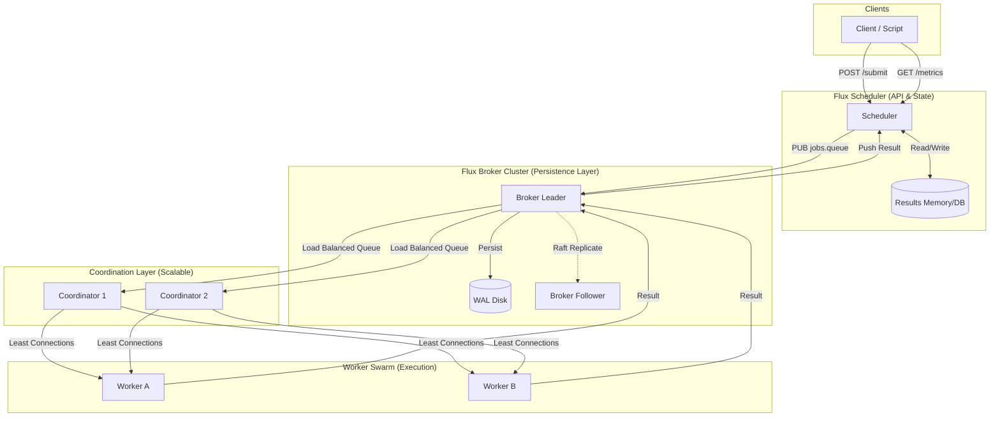

<div align="center">
  
</div>

# Flux

**Distributed job scheduler using a custom Raft-based broker with WAL persistence, time-based scheduling, and intelligent worker coordination.**

Flux is a production-grade distributed message broker written in Go, featuring a complete job scheduler implementation built on top. The system demonstrates real-world distributed systems patterns including Raft consensus clustering, write-ahead logging, and smart task distribution across dynamic worker pools.

## System Components

### Message Broker (Core Infrastructure)
A high-performance Pub/Sub broker providing the communication backbone:
- **Raft Consensus Clustering**: Leader election and log replication for fault tolerance
- **Write-Ahead Log (WAL)**: Persistent, append-only storage with O(1) writes
- **Message Deduplication**: Exactly-once processing using strict Message-IDs
- **Flow Control**: Rate limiting and backpressure protection
- **Atomic Headers**: Key-value metadata support separate from payload
- **Dead Letter Queues (DLQ)**: Automatic routing of failed deliveries

### Job Scheduler (Application Layer)
A distributed task execution system using the broker:
- **Time-Based Scheduling**: Execute jobs at specific future timestamps
- **Smart Load Balancing**: CPU-aware worker selection via heartbeats
- **Worker Discovery**: Dynamic worker registration and health monitoring
- **Shell & Docker Execution**: Support for both shell commands and containerized tasks
- **Reliable Delivery**: ACK-based guarantees prevent job loss
- **Status Tracking**: Real-time job execution monitoring

## Quick Start

### Running the Job Scheduler

1. **Start the Broker**
```bash
./server.exe
```

2. **Start the Scheduler**
```bash
./scheduler.exe
```

3. **Start the Coordinator**
```bash
./coordinator.exe
```

4. **Start a Worker**
```bash
./worker.exe worker-1
```

5. **Submit a Job** (via PowerShell)
```powershell
$body = @{
    type = "shell"
    payload = "echo Hello World"
    run_in_seconds = 5
} | ConvertTo-Json

Invoke-RestMethod -Uri "http://localhost:8080/submit" -Method Post -Body $body -ContentType "application/json"
```

### Automated Test
```powershell
.\test_flow.ps1
```

## Architecture

### Architecture Diagram


### Message Flow
1. **Submission**: User submits job to Scheduler API. Scheduler persists to Broker (`jobs.queue`).
2. **Coordination**: Coordinator receives job from Broker (Round-Robin).
3. **Assignment**: Coordinator selects worker with **Least Active Jobs** (using CPU usage as tie-breaker).
4. **Execution**: Worker executes payload (Shell/Docker) and reports status back to Broker (`jobs.status`).
5. **Completion**: Scheduler receives status and updates metrics/history.

### Broker Channels
| Channel | Purpose |
| :--- | :--- |
| `jobs.queue` | Pending jobs ready for assignment |
| `worker.heartbeat` | Worker health and CPU status broadcasts |
| `worker.{id}.jobs` | Direct job delivery to specific worker |
| `jobs.status` | Job execution results and status updates |

## Core Features

### Messaging Fundamentals
- **High Performance Protocol**: Text-based TCP with pipelining support
- **Subject-Based Addressing**: Hierarchical routing (e.g., `orders.us.created`)
  - Wildcards: `*` (single token), `>` (all subsequent tokens)
- **Queue Groups**: Load balanced consumption across subscriber pools

### Persistence & Durability
- **Write-Ahead Log (WAL)**: Segmented log files with automatic rotation
- **Durable Subscriptions**: Consumer cursor tracking for crash recovery
- **Retention Policies**:
  - Time-based expiration (e.g., 24h)
  - Capacity-based rotation (e.g., 5GB limit)

### Clustering & High Availability
- **Raft Consensus**: Industry-standard leader election and replication
- **Zero Data Loss**: Quorum-based write confirmation
- **Automatic Failover**: Sub-second leader promotion
- **Dynamic Membership**: Runtime JOIN/LEAVE operations

### Advanced Capabilities
- **Flow Control**: Token bucket rate limiting + backpressure
- **Review & Replay**: Historical data access by sequence or timestamp
- **Message Deduplication**: Exactly-once delivery windows

## Protocol Overview

### Client Commands

| Command | Syntax | Description |
| :--- | :--- | :--- |
| **PUB** | `PUB <subject> <len>` | Publish message payload |
| **HPUB** | `HPUB <subj> <hdr_len> <tot_len>` | Publish with headers |
| **SUB** | `SUB <subject> <sid> [group]` | Subscribe to topic |
| **ACK** | `ACK <seq> [durable_key]` | Acknowledge message receipt |
| **PULL** | `PULL <subject> <count>` | Request messages (pull mode) |
| **FLOWCTL** | `FLOWCTL <sid> <mode> [args]` | Configure flow control |
| **STATS** | `STATS [sid]` | Request statistics |
| **PING** | `PING` | Keep-alive check |
| **REPLAY** | `REPLAY <seq|time> <val>` | Replay from sequence/timestamp |

### Server Responses

| Command | Syntax | Description |
| :--- | :--- | :--- |
| **MSG** | `MSG <subj> <sid> <len> <seq>` | Message delivery |
| **+OK** | `+OK [msg]` | Operation success |
| **-ERR** | `-ERR <error>` | Operation error |
| **PONG** | `PONG` | PING response |

### Cluster Commands (Admin)

| Command | Syntax | Description |
| :--- | :--- | :--- |
| **JOIN** | `JOIN <node_id> <addr>` | Add node to cluster |
| **LEAVE** | `LEAVE <node_id>` | Remove node from cluster |

## Configuration

Example `config.json`:

```json
{
  "server": {
    "port": ":4223",
    "data_dir": "data"
  },
  "ack": {
    "timeout": "60s",
    "max_retries": 3
  },
  "retention": {
    "max_age": "24h",
    "max_bytes": 1073741824
  },
  "flow_control": {
    "enable_rate_limit": true,
    "default_buffer_size": 10000,
    "backpressure_mode": "block"
  }
}
```

## Build

```bash
# Build all components
go build -o server.exe ./cmd/server
go build -o scheduler.exe ./cmd/scheduler
go build -o coordinator.exe ./cmd/coordinator
go build -o worker.exe ./cmd/worker
```

## Use Cases

- **Task Scheduling**: Cron-like job execution with distributed workers
- **Message Queue**: Reliable Pub/Sub for microservices
- **Event Streaming**: Real-time data pipeline backbone
- **Job Processing**: Background task execution (video encoding, data processing)
- **Distributed Systems Learning**: Reference implementation of Raft, WAL, and consensus patterns
